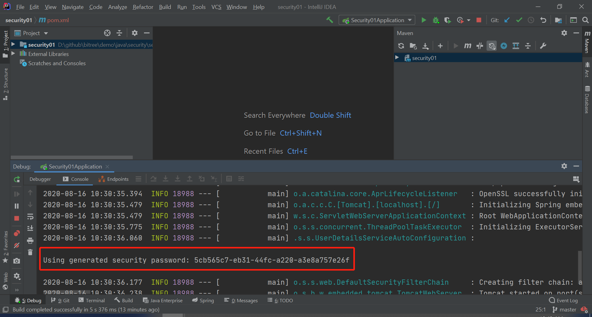
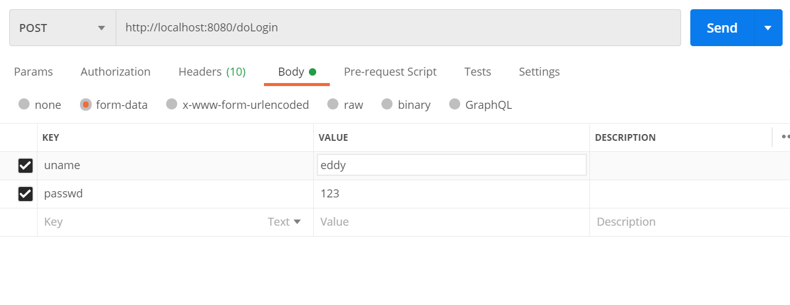
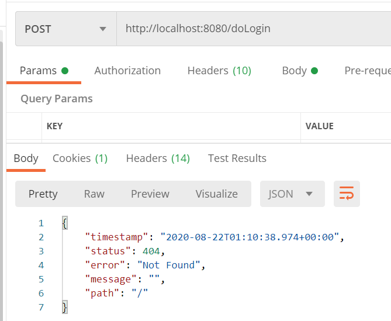
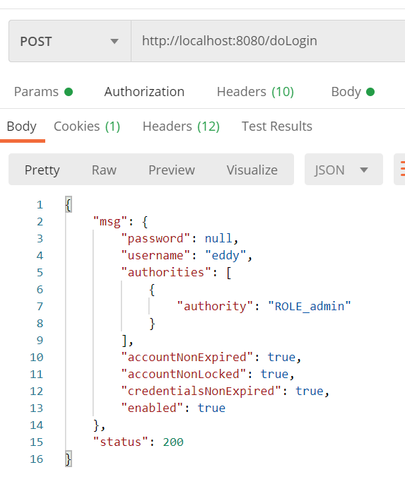

# 项目创建

pom.xml 中的 Spring Security 依赖：

```
<dependency>
    <groupId>org.springframework.boot</groupId>
    <artifactId>spring-boot-starter-security</artifactId>
</dependency>
```


# 默认配置

user: user

Password: 



# application.properties中配置

# 代码中配置

```java
//点击登陆安钮访问的url,也就是postman中调用的url
loginProcessingUrl("/doLogin")
```

doLogin方式1




方式2


doLogin成功后， 会报404错误，实际上已经login已经成功了，后自动跳转的"/"




添加successHandler后可以直接返回json

```java
successHandler(new AuthenticationSuccessHandler() {
                    @Override
                    public void onAuthenticationSuccess(HttpServletRequest httpServletRequest, HttpServletResponse httpServletResponse, Authentication authentication) throws IOException, ServletException {
                        httpServletResponse.setContentType("application/json;charset=utf-8");
                        PrintWriter out = httpServletResponse.getWriter();
                        Map<String, Object> map = new HashMap<>();
                        map.put("status", 200);
                        map.put("msg", authentication.getPrincipal());
                        out.write(new ObjectMapper().writeValueAsString(map));
                        out.flush();
                        out.close();
                    }
                })
```




# 多个 HttpSecurity

