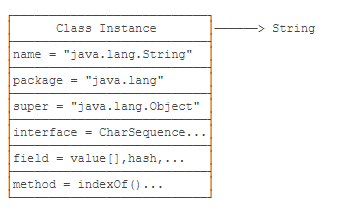

# throws

```java
int div(int x, int y) throws Exception {
        return  x/y;
    }
```

>  表示不管是否有异常，都在调用此方法处进行异常处理。

# static代码块

```java
public class Person {

    public  Person(){
        System.out.println("This is Constructor!");
    }

    static {
        System.out.println("This is static block 2");
    }

    static {
        System.out.println("This is static block 1");
    }
}
```

> static块可以置于类中的任何地方
>
> 类中可以有多个static块
>
> 类初次被加载的时候，会按照static块的顺序来执行每个static块，并且只会执行一次

# Class



```java
public final class Class {
    private Class() {}
}

Class cls = new Class(String);

Class cls = String.class;

String s = "Hello";
Class cls = s.getClass();

Class cls = Class.forName("java.lang.String");
```

# Annotation

- met annotation

  - #### @Target

  - #### @Retention

  - #### @Repeatable

  - #### @Inherited

  ```java
  @Retention(RetentionPolicy.RUNTIME)
  @Target(ElementType.FIELD)
  public @interface Range {
      int min() default 0;
      int max() default 255;
  }
  
  public class Person {
      @Range(min=1, max=20)
      public String name;
  
      @Range(max=10)
      public String city;
  }
  
  void check(Person person) throws IllegalArgumentException, ReflectiveOperationException {
      // 遍历所有Field:
      for (Field field : person.getClass().getFields()) {
          // 获取Field定义的@Range:
          Range range = field.getAnnotation(Range.class);
          // 如果@Range存在:
          if (range != null) {
              // 获取Field的值:
              Object value = field.get(person);
              // 如果值是String:
              if (value instanceof String) {
                  String s = (String) value;
                  // 判断值是否满足@Range的min/max:
                  if (s.length() < range.min() || s.length() > range.max()) {
                      throw new IllegalArgumentException("Invalid field: " + field.getName());
                  }
              }
          }
      }
  }
  ```

  # 范型
  
  - 通配符
  
    ```java
    public class Main {
    
        public static void main(String[] args) {
            Info<String> s = new Info<String>();
            //error
            //Info<?> s = new Info<String>();
            s.setVar("eddy");
            fun(s);
        }
    
        public static void fun(Info<?> temp){
            System.out.println(temp);
        }
    }
    ```
  
    

- 受限泛型

  - 泛型上限

    ```java
    //只是能继承 Number的类
    public static void fun(Info<? extends Number> temp){
            System.out.println(temp);
        }
    ```

    ```java
    // 在声名处直接指定上限
    public class Info<T extends Number> {
        private T var;
    
        public T getVar() {
            return var;
        }
    
        public void setVar(T var) {
            this.var = var;
        }
    }
    ```
    
  - 泛型下限

    ```java
    // 只能是Number和他的父类类型, 这里就是Number和Object 
    public static void fun(Info<? super Number> temp){
            System.out.println(temp);
        }
    ```
    
    

    