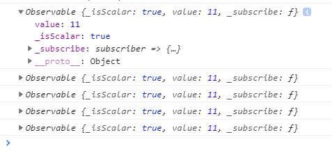
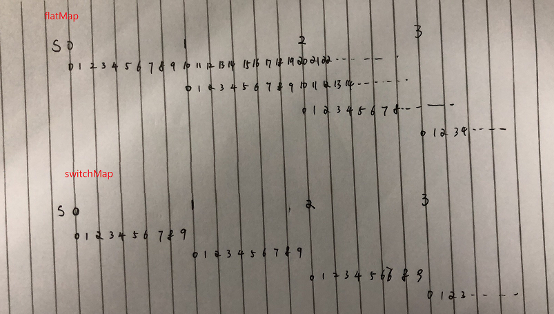

# 操作符

## map

>  对源 observable 的每个值应用投射函数。


```typescript
    const source = interval(1000)
      .pipe(
        take(5),
        map(x => x * 2)
      );
    source.subscribe(x => console.log(x));//0,2,4,6,8
```


# flatMap/mergeMap

>  flatMap是mergeMap的别名,主要用来打平，那什么是打平呢
>
> ```javascript
>  const source = interval(1000)
>       .pipe(
>         take(5),
>         map(()=>of(11))
>       );
> 
>     source.subscribe(x => console.log(x));
> ```
>
> 



可以看到输出了5个Observable,这显然不是我们想要的结果,来看一下使用flatMap的结果，这就是所谓的打平

```javascript
onst source = interval(1000)
      .pipe(
        take(5),
        //map(()=>of(11))
        flatMap(()=>of(11))//11,11,11,11,11
      );

    source.subscribe(x => console.log(x));
```

# switchMap

> switchMap 和其他打平操作符的主要区别是它具有取消效果。在每次发出时，会取消前一个内部 observable (你所提供函数的结果) 的订阅，然后订阅一个新的 observable 。你可以通过短语切换成一个新的 observable来记忆它.

```javascript
	// 立即发出值， 然后每5秒发出值
    const source = timer(0, 5000);
    // 当 source 发出值时并不会取消前一个内部observal的订阅
    const example = source.pipe(flatMap(() => interval(500)));
    // 输出: 0,1,2,3,4,5,6,7,8,9,10,0,11,1,12,2,13.....
    const subscribe = example.subscribe(val => console.log(val));
```

```javascript
// 立即发出值， 然后每5秒发出值
    const source = timer(0, 5000);
    // 当 source 发出值时切换到新的内部 observable，发出新的内部 observable 所发出的值,取消以前的订阅
    const example = source.pipe(switchMap(() => interval(500)));
    // 输出: 0,1,2,3,4,5,6,7,8,9...0,1,2,3,4,5,6,7,8
    const subscribe = example.subscribe(val => console.log(val));
```

> 横向一格认为是1秒时间，source每隔5秒发出一个值，对应触发新的observable
>
> > flatMap,不会取消前一个observable的订阅所以值会一直发出去
> >
> > swithMap会取消前一个订阅

